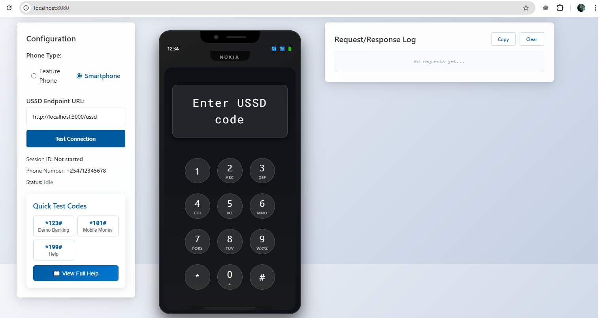
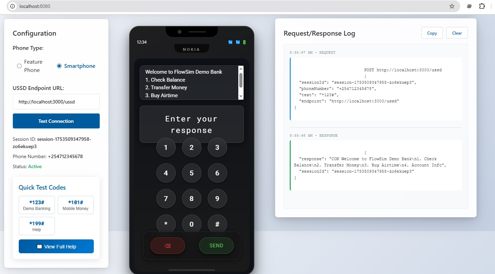
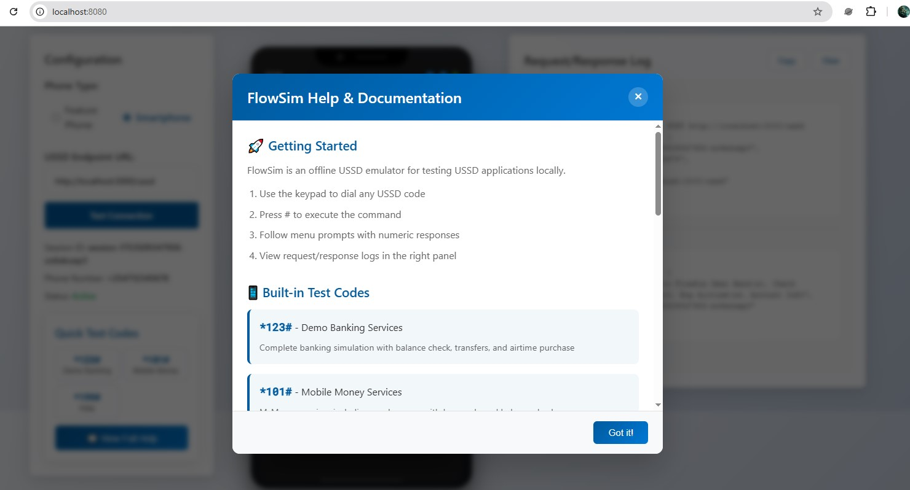

# FlowSim: USSD Simulator

FlowSim is a powerful and intuitive tool designed for developers to test, debug, and simulate USSD (Unstructured Supplementary Service Data) applications in a local environment. It provides a web-based interface that mimics a feature phone, allowing you to interact with your USSD service as if you were a real user.



## 🚀 Key Features

- **Visual USSD Simulation:** A user-friendly, phone-like interface to visualize and interact with your USSD menus and flows.
- **Real-time Interaction:** Enter USSD codes and see the responses from your application instantly.
- **Flexible Endpoint Configuration:** Test against local development servers or remote staging environments with ease.
- **Session Management:** Simulates real-world USSD sessions with configurable timeouts.
- **Cross-Platform:** Built with Go, FlowSim is a single binary that runs on Windows, macOS, and Linux.
- **Easy to Use:** Simply run the executable and start testing. No complex setup required.

## 🛠️ How It Works

FlowSim starts a local web server that serves a frontend application. This frontend provides the phone simulator interface. When you interact with the simulator, it sends requests to the FlowSim backend, which then forwards them to your specified USSD application endpoint.



## 🏁 Getting Started

### Prerequisites

- Go (1.18 or later) installed on your system.

### Installation & Running

1. **Clone the repository:**
   ```bash
   git clone https://github.com/your-username/flowsim.git
   cd flowsim
   ```

2. **Run the application:**
   ```bash
   go run .
   ```

3. **Open your browser:**
   Navigate to `http://localhost:8080` to start using the simulator.

## 🐳 Docker Usage

You can also run FlowSim using Docker. The official image is available on Docker Hub.

1.  **Pull the image:**
    ```bash
    docker pull murunga/ussd-tester:latest
    ```

2.  **Run the container:**
    ```bash
    docker run -p 8080:8080 murunga/ussd-tester:latest
    ```

3.  **Open your browser:**
    Navigate to `http://localhost:8080` to start using the simulator.


## 📖 Usage

1. **Enter your USSD application's endpoint URL** in the "USSD Endpoint" field.
2. **Enter a USSD code** (e.g., `*123#`) in the phone's input field and press "Send".
3. **Interact with your USSD application** through the phone interface.



## Example USSD Server

Don't have a USSD application to test with? We've included example servers in Python and Node.js in the `/examples` directory to get you started.

### Python Example

```bash
cd examples
pip install -r requirements.txt # If there's a requirements file
python example-server.py
```

### Node.js Example

```bash
cd examples
npm install
node example-server.js
```

Now you can use the FlowSim simulator to send requests to `http://localhost:5000` (for Python) or `http://localhost:3000` (for Node.js).

## 🤝 Contributing

Contributions are welcome! Please feel free to submit a pull request or open an issue for any bugs, feature requests, or improvements.

## 📄 License

This project is licensed under the MIT License. See the [LICENSE](LICENSE) file for details.
